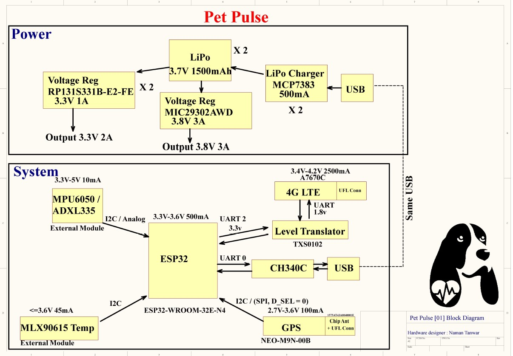
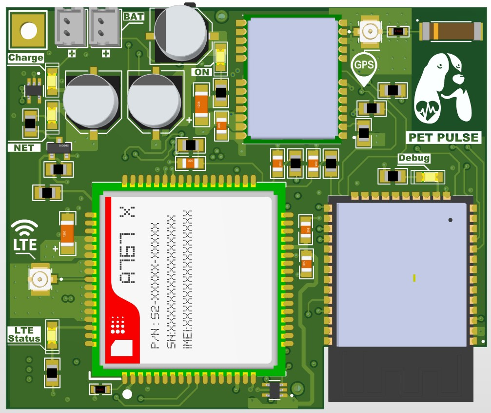

# PetPulse
This project aims to develop a custom wearable smart pet device to monitor their day-to-day activities. The device is capable of determining the heart rate, temperature, current status, and live location of the pet.

## Block Diagram

## PCB Front Render

## PCB Back Render

